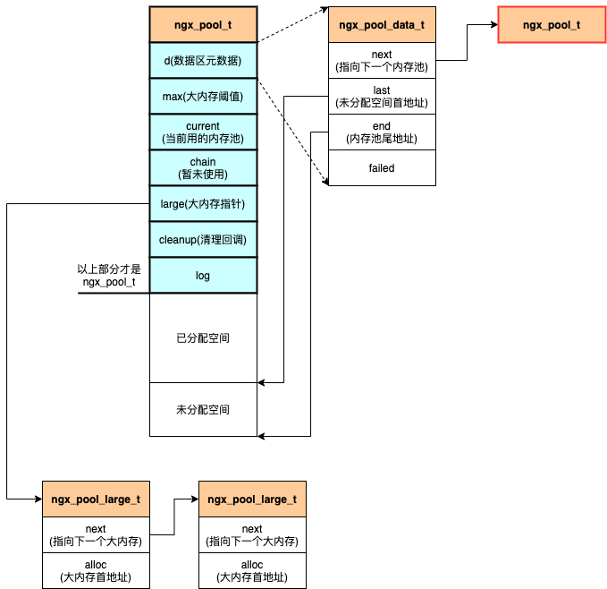

# 内存池

<!-- TOC -->

- [内存池](#内存池)
    - [概述](#概述)
    - [函数](#函数)
        - [ngx_create_pool](#ngx_create_pool)
        - [ngx_destroy_pool](#ngx_destroy_pool)
        - [ngx_reset_pool](#ngx_reset_pool)
        - [ngx_palloc](#ngx_palloc)
        - [ngx_pnalloc](#ngx_pnalloc)
        - [ngx_pcalloc](#ngx_pcalloc)
        - [ngx_pmemalign](#ngx_pmemalign)
        - [ngx_pfree](#ngx_pfree)
        - [ngx_pool_cleanup_add](#ngx_pool_cleanup_add)
        - [ngx_pool_run_cleanup_file](#ngx_pool_run_cleanup_file)
        - [ngx_pool_cleanup_file](#ngx_pool_cleanup_file)
        - [ngx_pool_delete_file](#ngx_pool_delete_file)
    - [原理](#原理)
        - [结构体](#结构体)
        - [内存布局](#内存布局)
        - [内存池的串接](#内存池的串接)
        - [大内存分配](#大内存分配)
        - [cleanup](#cleanup)

<!-- /TOC -->

## 概述

内存池源代码位置：

- src/core/ngx_palloc.h
- src/core/ngx_palloc.c

函数声明 | 描述
-|-
[ngx_create_pool](#ngx_create_pool) | 创建新的内存池。
[ngx_destroy_pool](#ngx_destroy_pool) | 释放内存池。内存池结构将不可用。
[ngx_reset_pool](#ngx_reset_pool) | 重置内存池。将大内存和小内存的数据空间全部清空释放，内存池结构仍然可用。
[ngx_palloc](#ngx_palloc) | 分配内存空间，数据对齐。
[ngx_pnalloc](#ngx_pnalloc) | 分配内存空间，数据不强制对齐。
[ngx_pcalloc](#ngx_pcalloc) | 分配内存空间，并初始化为 0，数据对齐。
[ngx_pmemalign](#ngx_pmemalign) | 强制作为大内存空间进行分配，并且数据对齐。
[ngx_pfree](#ngx_pfree) | 内存空间释放。需要注意，仅支持大内存空间的释放。
[ngx_pool_cleanup_add](#ngx_pool_cleanup_add) | 添加内存池销毁时进行回调的函数。通常用于在内存池销毁的同时对文件进行关闭或者删除。
[ngx_pool_run_cleanup_file](#ngx_pool_run_cleanup_file) | 用注册的文件关闭函数对文件描述符进行关闭。
[ngx_pool_cleanup_file](#ngx_pool_cleanup_file) | Nginx 提供的文件关闭回调函数。
[ngx_pool_delete_file](#ngx_pool_delete_file) | Nginx 提供的文件删除回调函数。

## 函数

### ngx_create_pool

创建新的内存池。

声明：

```c
ngx_pool_t *ngx_create_pool(size_t size, ngx_log_t *log)
```

输入参数 | 描述
-|-
size | 预分配的内存池的大小。实际存储数据的空间大小为 `size - sizeof(ngx_pool_t)`。
log | 日志结构体，用于输出信息到日志。

返回值 | 描述
-|-
非 NULL | 内存池对象指针。
NULL | 内存池分配失败。

示例：

```c
ngx_pool_t                  *pool;
pool = ngx_create_pool(NGX_DEFAULT_POOL_SIZE, r->connection->log);

if (pool == NULL) {
    return NGX_CONF_ERROR;
}
```

### ngx_destroy_pool

释放内存池。内存池结构将不可用。

声明：

```c
void ngx_destroy_pool(ngx_pool_t *pool)
```

输入参数 | 描述
-|-
pool | 需要释放的内存池。

示例：

```c
ngx_pool_t                  *pool;
pool = ngx_create_pool(NGX_DEFAULT_POOL_SIZE, r->connection->log);

if (pool) {
    ngx_destroy_pool(pool);
}
```

### ngx_reset_pool

重置内存池。将大内存和小内存的数据空间全部清空释放，内存池结构仍然可用。

声明：

```c
void ngx_reset_pool(ngx_pool_t *pool)
```

输入参数 | 描述
-|-
pool | 需要重置的内存池。

示例：

```c
ngx_pool_t                  *pool;
pool = ngx_create_pool(NGX_DEFAULT_POOL_SIZE, r->connection->log);

if (pool) {
    ngx_reset_pool(pool);
}
```

### ngx_palloc

分配内存空间，数据对齐。

声明：

```c
void *ngx_palloc(ngx_pool_t *pool, size_t size)
```

输入参数 | 描述
-|-
pool | 从指定的内存池分配内存。
size | 分配的大小。当 `size > pool->max` 时会使用大内存分配。

返回值 | 描述
-|-
非 NULL | 成功分配的内存地址。
NULL | 分配失败。

示例：

```c
ngx_pool_t                  *pool;
pool = ngx_create_pool(NGX_DEFAULT_POOL_SIZE, r->connection->log);
if (pool == NULL) {
    return NULL;
}

ngx_str_t *name;

name = ngx_palloc(pool, sizeof(ngx_str_t));
ngx_str_set(name, "test ngx_palloc");

ngx_log_error(NGX_LOG_ERR, r->connection->log, 0, "name: %V", name);
```

### ngx_pnalloc

分配内存空间，数据不强制对齐。

```c
void *ngx_pnalloc(ngx_pool_t *pool, size_t size)
```

输入参数 | 描述
-|-
pool | 从指定的内存池分配内存。
size | 分配的大小。当 `size > pool->max` 时会使用大内存分配。

返回值 | 描述
-|-
非 NULL | 成功分配的内存地址。
NULL | 分配失败。

示例：

```c
ngx_pool_t                  *pool;
pool = ngx_create_pool(NGX_DEFAULT_POOL_SIZE, r->connection->log);
if (pool == NULL) {
    return NULL;
}

ngx_str_t *name;

name = ngx_pnalloc(pool, sizeof(ngx_str_t));
ngx_str_set(name, "test ngx_pnalloc");

ngx_log_error(NGX_LOG_ERR, r->connection->log, 0, "name: %V", name);
```

### ngx_pcalloc

分配内存空间，初始化空间数据为 0，数据对齐。

```c
void *ngx_pcalloc(ngx_pool_t *pool, size_t size)
```

输入参数 | 描述
-|-
pool | 从指定的内存池分配内存。
size | 分配的大小。当 `size > pool->max` 时会使用大内存分配。

返回值 | 描述
-|-
非 NULL | 成功分配的内存地址。
NULL | 分配失败。

示例：

```c
ngx_pool_t                  *pool;
pool = ngx_create_pool(NGX_DEFAULT_POOL_SIZE, r->connection->log);
if (pool == NULL) {
    return NULL;
}

ngx_str_t *name;

name = ngx_pcalloc(pool, sizeof(ngx_str_t));
ngx_str_set(name, "test ngx_pcalloc");

ngx_log_error(NGX_LOG_ERR, r->connection->log, 0, "name: %V", name);
```

### ngx_pmemalign

```c
void *ngx_pmemalign(ngx_pool_t *pool, size_t size, size_t alignment)
```

### ngx_pfree

内存空间释放。需要注意，仅支持大内存空间的释放。

```c
ngx_int_t ngx_pfree(ngx_pool_t *pool, void *p)
```

输入参数 | 描述
-|-
pool | 释放指针所处的内存池。
p | 释放的内存指针。

返回值 | 描述
-|-
NGX_OK | 回收完毕。
NGX_DECLINED | 没有找到内存指针，无法回收。

示例：

```c
ngx_pool_t                  *pool;
pool = ngx_create_pool(NGX_DEFAULT_POOL_SIZE, r->connection->log);
if (pool == NULL) {
    return NULL;
}

ngx_str_t *name;

name = ngx_pcalloc(pool, sizeof(ngx_str_t));
ngx_str_set(name, "test ngx_pfree");

ngx_pfree(pool, name);
```

### ngx_pool_cleanup_add

添加内存池销毁时进行回调的函数。通常用于在内存池销毁的同时对文件进行关闭或者删除。

函数声明：

```c
ngx_pool_cleanup_t *ngx_pool_cleanup_add(ngx_pool_t *p, size_t size)
```

输入参数 | 描述
-|-
p | 所处的内存池。
size | 清理回调的 data 大小，如果为 0，则 `cleanup->data = NULL`。

返回值 | 描述
-|-
非 NULL | cleanup 结构体指针。
NULL | 分配失败。

示例：

```c
ngx_pool_t                  *pool;
ngx_pool_cleanup_t          *cln;

pool = ngx_create_pool(NGX_DEFAULT_POOL_SIZE, r->connection->log);
if (pool == NULL) {
    return NULL;
}

cln = ngx_pool_cleanup_add(pool, sizeof(ngx_pool_cleanup_file_t));
cln->handler = gx_pool_cleanup_file;
cln->data->fd = ...
cln->data->name = ...
cln->data->log = pool->log;

ngx_destroy_pool(pool)
```

### ngx_pool_run_cleanup_file

```c
void ngx_pool_run_cleanup_file(ngx_pool_t *p, ngx_fd_t fd)
```

### ngx_pool_cleanup_file

Nginx 提供的文件关闭回调函数。

```c
void ngx_pool_cleanup_file(void *data)
```

输入参数 | 描述
-|-
data | 回调使用的数据。这是一种 ngx_pool_cleanup_file_t 类型的指针。

### ngx_pool_delete_file

Nginx 提供的文件删除回调函数。

```c
void ngx_pool_delete_file(void *data)
```

输入参数 | 描述
-|-
data | 回调使用的数据。这是一种 ngx_pool_cleanup_file_t 类型的指针。

## 原理

内存池其实并非仅仅是一块内存池，而是由多个内存池串联起来构成的，当一个内存池不够用时，就会在该内存池上串一个新分配的内存池，并通过新内存池进行空间分配。

### 结构体

```c
typedef struct ngx_pool_s           ngx_pool_t;
typedef struct ngx_pool_data_s      ngx_pool_data_t;
typedef struct ngx_pool_large_s     ngx_pool_large_t;
typedef struct ngx_pool_cleanup_s   ngx_pool_cleanup_t;

/* 对业务代码暴露的结构体 */
struct ngx_pool_s {
    ngx_pool_data_t       d;            // 内存池的元数据区域（指定了数据区域的可用首地址、尾地址等）
    size_t                max;          // 进行大内存空间分配的阈值。
    ngx_pool_t           *current;      // 指向当前的内存池指针地址
    ngx_chain_t          *chain;        // 这个没有用到
    ngx_pool_large_t     *large;        // 存储大内存空间指针的链表
    ngx_pool_cleanup_t   *cleanup;      // 可自定义回调函数，清除内存块分配的内存
    ngx_log_t            *log;          // 内存池相关操作时使用的日志
};

struct ngx_pool_data_s {
    u_char               *last;         // 指向内存池未分配部分的首地址
    u_char               *end;          // 指向内存池的结束地址
    ngx_pool_t           *next;         // 指向下一个内存池
    ngx_uint_t            failed;       // 每次需要分配新内存池时（即当前内存池无法满足需求），涉及到的内存池 failed + 1。
};

struct ngx_pool_large_s {
    ngx_pool_large_t     *next;         // 下一个大数据指针
    void                 *alloc;        // 数据块指针地址
};

struct ngx_pool_cleanup_s {
    ngx_pool_cleanup_pt   handler;      // 回调处理函数
    void                 *data;         // 回调处理数据
    ngx_pool_cleanup_t   *next;         // 下一个清理回调
};
```

### 内存布局



### 内存池的串接

每次分配内存实际上是在 `ngx_pool_t->current` 的内存池数据区上分配连续的地址空间，如果该内存池空间不足，则会申请新的内存池，并在新的内存池上分配连续地址空间。

为了避免串联太多的内存池时，导致遍历链表，因此会尽量仅保证最后 4 个内存池是可用的，也就是说首个内存池的 current 的指针会指向倒数第四个 ngx_pool_t。

### 大内存分配

内存池实际上是由多个 ngx_pool_t 进行串联而成的，每个 ngx_pool_t 的大小为 size，因此实际数据区大小为 `size - sizeof(ngx_pool_t)`。

当一次分配的空间超过了单个内存池的数据区大小，则属于大块内存分配，会直接通过 `ngx_alloc` 函数分配。

大内存分配的指针会通过 `ngx_pool_t->large` 进行串联。

**注意：**

- 大内存分配的指针都由`首个内存池`的 large 指针进行维护。
- 仅仅大内存空间可以进行内存释放，并且释放时会遍历链表。
- 判断是否为申请大内存的依据是 `ngx_pool_t->max`，通常情况下，`ngx_pool_t->max = size - sizeof(ngx_pool_t)`，但当数据区域过大，并超过了 NGX_MAX_ALLOC_FROM_POOL 时（x86 中为 4KB），以 NGX_MAX_ALLOC_FROM_POOL 作为 max。

  ```c
  // 数据存储空间大小
  size = size - sizeof(ngx_pool_t);
  p->max = (size < NGX_MAX_ALLOC_FROM_POOL) ? size : NGX_MAX_ALLOC_FROM_POOL;
  ```

### cleanup

可以为内存池添加销毁时的回调函数，该回调函数用 cleanup 进行表示。

```c
void
ngx_destroy_pool(ngx_pool_t *pool)
{
    ngx_pool_t          *p, *n;
    ngx_pool_large_t    *l;
    ngx_pool_cleanup_t  *c;

    for (c = pool->cleanup; c; c = c->next) {
        if (c->handler) {
            ngx_log_debug1(NGX_LOG_DEBUG_ALLOC, pool->log, 0,
                           "run cleanup: %p", c);
            c->handler(c->data);
        }
    }

    // ...
}
```

Nginx 经常用这样的方式来保障内存池释放的同时，清理文件或者关闭文件。对于文件的清理和关闭，都要求 `ngx_pool_cleanup_t->data` 指向 `ngx_pool_cleanup_file_t` 结构：

```c
typedef struct {
    ngx_fd_t              fd;
    u_char               *name;
    ngx_log_t            *log;
} ngx_pool_cleanup_file_t;
```
