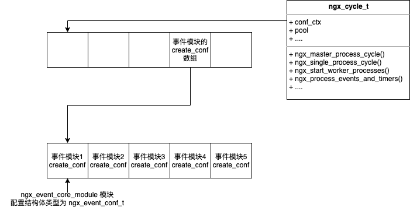

# 事件模块

<!-- TOC -->

- [事件模块](#事件模块)
    - [概述](#概述)
    - [Nginx 的事件](#nginx-的事件)
    - [Nginx 的连接](#nginx-的连接)
        - [被动连接](#被动连接)
        - [主动连接](#主动连接)
        - [ngx_connectino_t 连接池](#ngx_connectino_t-连接池)
    - [核心模块 ngx_events_module](#核心模块-ngx_events_module)
        - [核心模块配置](#核心模块配置)
        - [ngx_events_block](#ngx_events_block)
        - [事件模块的配置项管理](#事件模块的配置项管理)
    - [ngx_event_core_module 模块](#ngx_event_core_module-模块)
    - [epoll](#epoll)
        - [基础](#基础)
        - [ngx_epoll_module](#ngx_epoll_module)
        - [数据结构](#数据结构)
        - [初始化](#初始化)
        - [添加事件](#添加事件)
        - [处理事件](#处理事件)
    - [定时器事件](#定时器事件)
    - [事件驱动框架处理流程](#事件驱动框架处理流程)
        - [建立新连接](#建立新连接)
        - [惊群](#惊群)
        - [负载均衡](#负载均衡)
        - [POST 事件队列](#post-事件队列)
        - [ngx_process_events_and_timers](#ngx_process_events_and_timers)

<!-- /TOC -->

## 概述

核心模块中的 ngx_event_module 定义了事件模块，对于事件模块，其通用接口是 `ngx_event_module_t`（就是 `ngx_module_t` 中 ctx 对应的数据结构）。

Nginx Event 模块通用接口：

```c
typedef struct {
    ngx_str_t   *name;      // 事件模块的名称

    // 创建配置文件存储结构
    // 在核心模块 ngx_events_module 的 `event {}` 解析时触发子模块的配置项创建
    void        *(*create_conf)(ngx_cycle_t *cycle);

    // 解析完模块的配置后触发
    char        *(*init_conf)(ngx_cycle_t *cycle);

    // 对于实现事件驱动的模块，必须实现该结构体的方法
    ngx_event_actions   actions;

} ngx_event_module_t;
```

事件驱动的必要接口：

```c
typedef struct {
    // 向 Event Loop 中添加事件，事件发生后通过 process_events 会获取这个事件
    ngx_int_t   (*add)(ngx_event_t *ev, ngx_int_t event, ngx_uint_t flags);
    ngx_int_t   (*del)(ngx_event_t *ev, ngx_int_t event, ngx_uint_t flags);

    // 启用/禁止一个事件，目前 Nginx 框架不会使用这两个方法
    ngx_int_t   (*enable)(ngx_event_t *ev, ngx_int_t event, ngx_uint_t flags);
    ngx_int_t   (*disable)(ngx_event_t *ev, ngx_int_t event, ngx_uint_t flags);

    // 向 Event Loop 中添加一个新的连接，这会自动的将读写事件添加到事件驱动机制中
    ngx_int_t   (*add_conn)(ngx_connection_t *c);
    ngx_int_t   (*del_conn)(ngx_connection_t *c, ngx_uint_t flags);

    // 仅在多线程会被调用，这里不展开
    ngx_int_t   (*process_changes)(ngx_cycle_t *cycle, ngx_uint_t nowait);

    // 事件循环每次进行的处理，是处理和分发事件的核心机制
    ngx_int_t   (*process_events)(ngx_cycle_t *cycle, ngx_msec_t timer, ngx_uint_t flags);

    // 初始化 Event Loop
    ngx_int_t   (*init)(ngx_cycle_t *cycle, ngx_msec_t timer);

    // 退出 Event Loop 的方法
    void        (*done)(ngx_cycle_t *cycle);
} ngx_event_actions;
```

## Nginx 的事件

每一个事件都通过 `ngx_event_t` 定义：

```c
typedef struct ngx_event_s ngx_event_t;

struct ngx_event_s {
    void        *data
    unsigned    write:1;
    unsigned    accept:1;
    unsigned    instance:1;
    unsigned    disabled:1;
    unsigned    ready:1;
    unsigned    oneshot:1;
    unsigned    eof:1;
    unsigned    error:1;
    unsigned    timeout:1;
    unsigned    timer_set:1;
    unsigned    delayed:1;
    unsigned    read_discarded:1;
    unsigned    unexpected_eof:1;
    unsigned    pending_eof:1;
    unsigned    posted_ready:1;
    unsigned    avaliable:1;

    // ============= 事件回调函数 =============
    ngx_event_handler_pt    handler;
    // ======================================

    ngx_uint_t          index;
    ngx_log_t           *log;
    ngx_rbtree_node_t   timer;
    unsigned            closed:1;
    unsigned            channel:1;
    unsigned            resolver:1;
    ngx_event_t         *next;
    ngx_event_t         **prev;
};
```

上述回调的函数原型为：

```c
typedef void (*ngx_event_handler_ptr)(ngx_event_t *ev);
```

很明显，回调的时候就把自身的事件作为参数进行传递。

事件是不需要创建的，事件伴随这连接，在 Nginx Worker 初始化的时候就创建好了，并存放于 ngx_cycle_t 中的 read_events 和 write_events（是在 `ngx_event_core_module` 的进程初始化回调 `ngx_event_process_init` 中进行创建的），并且会自动把读写事件挂在连接上。

我们并不会直接去生成事件，而是获得连接后，并操作连接的事件。

将事件往 Event Loop 中添加，可以借助以下两个函数：

```c
// 连接对应的接收缓冲区有数据时，触发事件回调。flags 是驱动方式，这里可以直接写 0。
ngx_int_t ngx_handler_read_event(ngx_event_t *rev, ngx_uint_t flags);

// 连接对应的写缓冲区至少有 lowat 空间时，触发事件回调
ngx_int_t ngx_handler_write_event(ngx_event_t *wev, size_t lowat);
```

## Nginx 的连接

### 被动连接

```c
typedef struct ngx_connection_s ngx_connection_t;

struct ngx_connection_s {
    void                *data;              //
    ngx_event_t         *read;              // 连接对应的读事件
    ngx_event_t         *write;             // 连接对应的写事件

    ngx_socket_t        fd;                 // 套接字句柄
    ngx_recv_pt         recv;               // 直接接收网络字符流的方法
    ngx_send_pt         send;               // 直接发送网络字符流的方法

    ngx_recv_chain_pt   recv_chain;         // 以 ngx_chain_t 为参数来接受网络字符流的方法
    ngx_send_chain_pt   send_chain;         // 以 ngx_chain_t 为参数来发送网络字符流的方法

    ngx_listening_t     *listening;         // 连接对应的监听对象 此连接由该监听对象创建

    off_t               sent;               // 这个连接上已经发送出去的字节数
    ngx_log_t           *log;               // 可以记录日志的 ngx_log_t 对象

    ngx_pool_t          *pool;              // 内存池，在 accept 一个新连接的时候，才会创建内存池

    struct sockaddr     *sockaddr;          // 连接客户端的 sockaddr 结构体
    socklen_t           socklen;            // sockaddr 结构体的长度
    ngx_str_t           addr_text;          // 连接客户端字符串的 IP 地址

    struct sockaddr     *local_sockaddr;    // 本机监听端口对应的 sockaddr listening 监听对象的 sockaddr 成员

    // 用于接收、缓存客户端发来的字符流 每个使用连接的模块可自由决定从连接池中分配多大的空间给 buffer
    // 对于 HTTP 模块，大小决定于 client_header_buffer_size
    ngx_buf_t           *buffer;
    ngx_queue_t         queue;              //

    // 连接使用次数 因为连接是在池子中预分配的，当有客户端连接使用了该对象，number 会递增 或者主动向 upstream 发起连接
    ngx_atomic_uint_t   number;

    ngx_uint_t          requests;           // 处理请求的次数

    unsigned            buffered:8;
    unsigned            log_error:3;
    unsigned            unexpected_eof:1;   //
    unsigned            timedout:1          //
    unsigned            error:1             //
    unsigned            destroyed:1         //
    unsigned            idle:1;             //
    unsigned            resuable:1;         //
    unsigned            close:1;            //
    unsigned            sendfile:1;
    unsigned            snadlowat:1;
    unsigned            tcp_nodelay:2;
    unsigned            tcp_nopush:2;
};
```

很明显，连接的接收、发送方法可以不同，每个事件消费模块都可以灵活的决定行为（因为不同的 Even Loop 发送和接收调用不一样）。

### 主动连接

Nginx 向 upstream 服务器主动发起连接，这样的连接被称为主动连接，用 `ngx_peer_connection_t` 结构体表示，该结构体是包装了 `ngx_connection_t`。

```c
typedef struct ngx_peer_connection_s ngx_peer_connection_t;

// 当使用长连接于上游服务器通信时，可通过该方法由连接池中获取一个新连接
typedef ngx_int_t (*ngx_event_get_peer_pt)(ngx_peer_connection_t *pc, void **data);

// 当使用连接于上游服务器通信时，通过该方法将使用完毕的连接释放给连接池
typedef void (*ngx_event_free_peer_pt)(ngx_peer_connection_t *pc, void *data, ngx_uint_t state);

struct ngx_peer_connection_s {
    ngx_connection_t            *connection;


    struct sockaddr             *sockaddr;          // 远端服务器的 socket 地址
    socklen_t                   socklen;            // socketaddr 地址的长度
    ngx_str_t                   *name;              // 远端服务器的名称

    ngx_uint_t                  tries;              // 当前连接出现异常失败后可以重试的次数 也就是允许的最多失败次数

    ngx_event_get_peer_pt       get;                // 获取连接的方法，如果使用长连接构成的连接池，必须要实现 get 方法
    ngx_event_free_peer_pt      free;               // 与 get 方法对应的释放连接的方法
    void                        *data;

    ngx_addr_t                  *local;             // 本机地址信息

    int                         rcvbuf;             // 套接字接收缓冲区大小
    ngx_log_t                   *log;               // 记录日志的 ngx_log_t 对象
    unsigned                    cached:1;           //
    unsigned                    log_error:2;
};
```

### ngx_connectino_t 连接池

ngx_cycle_t 中的 connections 和 free_connections 构建了一个连接池，free_connections 对应的连接并不是真的存在，而只是分配了数据结构存储空间。

- connections 指向了整个连接的首部。
- free_connections 指向了第一个空闲的连接。当需要新建连接，直接从 free_connections 头部分配一个连接结构。

当通过 ngx_listening_t 拿到了一个新进来的 socket 时，可以通过 `ngx_connection_t *ngx_get_connection(ngx_socket_t s, ngx_log_t *log)` 来分配连接，以及设置对应的读写 event。

## 核心模块 ngx_events_module

该模块定义了一类新的模块，即事件模块，满足模块的 ctx 指向的数据为 `ngx_event_module_t`。

对于核心模块 `ngx_events_module` 而言，只会解析一个指令，即 `events {}`，对于语句块中的指令解析，则是由 `events {}` 指令的回调函数来完成。

### 核心模块配置

```c
static ngx_command_t ngx_events_commands[] = {

    { ngx_string("events"),
      NGX_MAIN_CONF | NGX_CONF_BLOCK | NGX_CONF_NOARGS,
      ngx_events_block,     // 核心方法 会构造并初始化所有的子模块配置项
      0, 0, NULL},

    ngx_null_command
};

static ngx_core_module_t ngx_events_module_ctx = {
    ngx_string(events),
    NULL,
    NULL
};

ngx_module_t ngx_events_module = {
    NGX_MODULE_V1,
    ngx_events_module_ctx,
    ngx_events_commands,
    NGX_CORE_MODULE,

    NULL,
    NULL,
    NULL,

    NULL,
    NULL,
    NULL,
    NULL,

    NGX_MODULE_V1_PADDING
}
```

### ngx_events_block

在解析 `events {}` 指令时，会触发 `ngx_events_block` 回调，并完成以下工作：

1. 初始化所有事件模块的 ctx_index 序号。
1. 分配进行配置项存储的指针数组。注意，这个数组里面存储的是每个配置项的指针。
1. 调用所有事件模块的 `create_conf` 方法，放入到上述的对应的数组中。
1. 为所有事件模块解析 `nginx.conf`。
1. 调用所有事件模块的 `init_conf` 方法。

**注意：**

- 每个模块都有两个标号：
  - index 是模块在所有模块中的序号。
  - ctx_index 是模块在父模块中的序号。

  ```c
  struct ngx_module_s {
      ngx_uint_t ctx_index;
      ngx_uint_t index;
      ...
  };

  ngx_event_max_module = 0;
  for (i = 0; ngx_modules[i]; i++) {
      if (ngx_modules[i]->type != NGX_EVENT_MODULE) {
          continue;
      }
      ngx_modules[i]->ctx_index = ngx_event_max_module++;
  }
  ```

### 事件模块的配置项管理

ngx_cycle_t 中的 `void ****conf_ctx` 中保存了所有的配置项指针，每个事件模块的配置项都可以通过该数组索引。

conf_ctx 数组指向了不同的核心模块，每个核心模块的配置指针又指向了所有子模块的配置项指针，其事件模块配置项内存结构如下：



对于事件模块而言，可以通过 `ngx_event_get_conf` 获得对应事件模块的配置：

```c
// 先通过 ngx_get_conf 获得对应核心模块的配置存储数组，再通过 module.ctx_index 找到自己模块所在
#define ngx_event_get_conf(conf_ctx, module) \
(*(ngx_get_conf(conf_ctx, ngx_events_modules))) [module.ctx_index];

#define ngx_get_conf(conf_ctx, module) conf_ctx[module.index];
```

## ngx_event_core_module 模块

事件模块最重要的就是 ngx_event_core_module，它也是事件模块的首个模块，并且必须是第一个。该模块用于判断使用什么事件模块提供的事件机制，并且初始化对应的事件模块。

该模块并不实际实现事件驱动机制。

```c
static ngx_command_t ngx_event_core_commands[] = {
    {  ngx_string("worker_connections"),
       NGX_EVENT_CONF | NGX_CONF_TAKE1,
       ngx_event_connections,
       0, 0, NULL  },

    // 和 worker_connections 的含义一样
    {  ngx_string("connections"),
       NGX_EVENT_CONF | NGX_CONF_TAKE1,
       ngx_event_connections,
       0, 0, NULL  },

    // 决定使用哪个事件机制
    {  ngx_string("use"),
       NGX_EVENT_CONF | NGX_CONF_TAKE1,
       ngx_event_use,
       0, 0, NULL  },

    // 若打开，意味着某个 Worker 接收到连接事件的时候调用 accept 来获取尽可能多的连接
    {  ngx_string("multi_accept"),
       NGX_EVENT_CONF | NGX_CONF_FLAG,
       ngx_conf_set_flag_slot,
       0, offset(ngx_event_conf_t, multi_accept), NULL  },

    // 确定是否使用 accept_mutex 锁，默认打开
    {  ngx_string("accept_mutex"),
       NGX_EVENT_CONF | NGX_CONF_FLAG,
       ngx_conf_set_flag_slot,
       0, offset(ngx_event_conf_t, accept_mutex), NULL  },

    // accept_mutex 负载均衡后，延迟 accept_mutex_delay 毫秒后再试图处理新连接事件
    {  ngx_string("accept_mutex_delay"),
       NGX_EVENT_CONF | NGX_CONF_TAKE1,
       ngx_conf_set_msec_slot,
       0, offset(ngx_event_conf_t, accept_mutex_delay), NULL  },

    ...

    ngx_null_command,
};


ngx_event_module_t ngx_event_core_module_ctx = {
    &event_core_name,
    ngx_event_create_conf,
    ngx_event_init_conf,

    // ngx_event_core_module 并不负责真正的网络驱动，所以 ngx_event_actions_t 的方法设置为 NULL
    {NULL, ...., NULL}
};

ngx_module_t ngx_event_core_module = {
    NGX_MODULE_V1,

    &ngx_event_core_module_ctx,
    ngx_event_core_commands,

    NGX_EVENT_NODULE,
    NULL,

    ngx_event_module_init,          // 只是初始化一些变量
    ngx_event_process_init,

    NULL,
    NULL,
    NULL,
    NULL,
    NGX_MODULE_V1_PADDING
}
```

ngx_event_core_module 除了生成配置项外，最重要的是它的进程初始化函数 `ngx_event_process_init`。

1. 判断是否打开 accept_mutex，要求使用 master-slave && worker 进程个数大于 1，否则不启用 accept_mutex。
1. 初始化用于定时器的红黑树。
1. 调用 `use` 指令指定的 event 模块的 `ngx_event_actions_t.init`，对实际的事件驱动进行初始化。
1. 如果配置了 `timer_resolution`，表明要控制时间精度，会以该时间为周期触发 TIMER 信号（通过函数 `setitimer(ITIMER_REAL, &itv, NULL)`），nginx 会给 TIMER 信号注册信号处理函数：

   ```c
   static void
   ngx_timer_signal_handler(int signo)
   {
       // 全局变量 每当 ngx_event_timer_alarm 为 1 的时候
       // ngx_event_actions_t.process_events 都会调用 ngx_time_update 更新时间

       ngx_event_timer_alarm = 1;
   }
   ```

1. 使用了 epoll，则会给 files 预分配句柄。
1. 预分配 ngx_connection_t
1. 预分配 read_events
1. 预分配 write_events
1. 构造 free_connections
1. 为所有的 ngx_listening_t 监听对象中的 connection 分配连接，并将 connection.read.handler 设置为 `ngx_event_accept`（会触发调用 ngx_listening_t 的回调 handler）。

## epoll

### 基础

- `int epoll_create(int size)`
  - 创建进行 IO复用的 fd。size 只是告诉大致需要处理的并发数目，而不是最大数目。在 Linux 当前的实现中，size 没有任何意义。
- `int epoll_ctl(int epfd, int op, int fd, struct epool_event* event)`
  - 向 ep 中添加、修改、删除感兴趣的事件，返回 0 表示成功，否则返回 -1。
  - fd 是监听的文件描述符。
  - event 是感兴趣的事件，当 fd 上发生了 fd 后，会被 epoll 感知到。
- `int epoll_wait(int epfd, struct epoll_event* events, int maxevents, int timeout)`
  - 等待，直到监听的 fd 中发生了 event或者超时（timeout 毫秒）。返回值是当前触发的事件个数。
  - 感兴趣的 event 会通过第二个参数返回。要求第二个参数内存已经分配。
  - maxevents 是一次返回的最大事件数，设置和 event 相同即可。
  - timeout，超时时间，毫秒。如果为 0，则不组塞，立即返回。

Nginx 中基本都是使用的 ET 模式（边缘触发，即状态发生改变后触发）。

### ngx_epoll_module

### 数据结构

### 初始化

ngx_epoll_module 的 ngx_event_actions_t.init 方法由 ngx_event_core_module 在模块的 process_init 时调用：

- 通过 `epoll_create` 创建 epoll 对象。
- 创建 event_list 数组，用于进行 epoll_wait 调用时传递内核态事件（就是用 `epoll_wait` 的 events 数组）。

```c
static ngx_int_t ngx_epoll_init(ngx_cycle_t *cycle, ngx_msec_t timer)
{
    ngx_epoll_conf_t    *epcf;

    // 获得由 create_conf 生成的 ngx_epoll_conf 结构体
    // create_conf 是在 ngx_events_module 解析 event {} 指令的回调函数中调用的
    epcf = ngx_event_get_conf(cycle->conf_ctx, ngx_epoll_module);

    if (ep == -1) {
        // Linux 中，该参数没有实际意
        ep = epoll_create(cycle->connection_n / 2);

        if (ep == -1) {
            ngx_log_error(NGX_LOG_EMERG, cycle->log, ngx_errno,
                          "epoll_create() failed");
            return NGX_ERROR;
        }
    }

    if (nevents < epcf->events) {
        // 猜测可能是重新加载配置，释放掉之前的 event_list
        if (event_list) {
            ngx_free(event_list);
        }

        // 分配用于 epoll_wait 的内存
        event_list = ngx_alloc(sizeof(struct epoll_event) *epcf->events, cycle->log);
        if (event_list == NULL) {
            return NGX_ERROR;
        }
    }

    // 每次 wait 返回时，events 传递的最大个数
    nevents = epcf->evnets;

    // 提供一个控制 Event Loop 的全局变量
    ngx_event_actions = ngx_epoll_module_ctx.actions;

    ...

    return NGX_OK;
}
```

### 添加事件

ngx_event_actions.add 提供了向事件循环添加监听事件的方法，在 epoll 中是这样实现的：

```c
static ngx_int_t ngx_epoll_add_event(ngx_event_t *ev, ngx_int_t event, ngx_uint_t flags) {
    int op;
    uint32_t events, prev;
    ngx_connection_t *c;
    struct epoll_event ee;

    // 事件对应的 data 就是连接
    c = ev->data

    events = (uint32_t) event;

    // 如果活跃，在代表 event 已经添加到 loop 中了，所以需要 modify。否则，是 add。
    if (e->active) {
        op = EPOLL_CTL_MOD;
    } else {
        op = EPOLL_CTL_ADD;
    }

    // 监听读事件或者写事件，以及用边缘触发或者水平触发
    ee.events = events | (uint32_t) flags;

    // epoll 回调事件的上下文 data 中存储连接的地址
    ee.data.ptr = (void *) ((uintptr_t) c | ev->instance)

    // 监听连接的描述符
    if (epoll_ctl(ep, op, c->fd, &ee) == -1) {
        return NGX_ERROR;
    }

    // 已经监听的事件 设置 active 为 1
    ev-active = 1;

    return NGX_OK;
}
```

### 处理事件

ngx_event_actions.process_events 是收集、分发事件的核心，epoll 对其的实现为：

```c
static ngx_int_t ngx_epoll_process_events(ngx_cycle_t *cycle, ngx_msec_t timer, ngx_uint_t flags) {

    int                 events;
    uint32_t            revents;
    ngx_int_t           instance, i;
    ngx_event_t         *rev, *weg, **queue,
    ngx_connection_t    *c;

    // 获取事件，并且超时时间为 timer
    events = epoll_wait(ep, event_list, (int) nevents, timer);

    ...

    // flags 标识当前是否更新时间
    // ngx_event_timer_alarm 由指定时间精度后，定期通过信号处理设置为 1
    if (flags & NGX_UPDATE_TIME || ngx_event_timer_alarm) {
        ngx_timer_update();
    }

    // 遍历本次 epoll_wait 的所有事件
    for (int i = 0; i < events; i++) {
        c = event_list[i].data.ptr;

        // 取出 instance 并恢复 connection 地址
        instance = (uintptr_t) c & 1;
        c = (ngx_connection_t *)((uintptr_t) c & (uintptr_t) ~1)

        // 取出读事件和事件类型
        rev = c->read;

        if (c->fd == -1 || rev->instance != instance) {
            continue;
        }

        revents = event_list[i].events;

        // 读事件且活跃
        if ((revents & EPOLLIN) && rev->active) {
            if (flags & NGX_POST_EVENTS) {
                // 如果需要延后处理，则添加到 queue 中
                // 对于非 accept 和 accept 使用的 queue 是分开的
                queue = (ngx_event_t **)(rev->accept ? &ngx_posted_accept_events : &ngx_posted_events);
                ngx_locked_post_event(rev, queue);
            } else {
                // 立即回调
                rev->handler(rev);
            }
        }

        // 取出写事件
        wev = c->write;

        // 写事件且活跃
        if ((revents & EPOLLOUT) && web->active) {
            if (c->fd == 01 || wev->instance != instance) {
                continue;
            }

            if (flags & NGX_POST_EVENTS) {
                ngx_locked_post_event(wev, &ngx_posted_events);
            } else {
                // 立即回调
                wev->handler(wev);
            }
        }
    }

    return NGX_OK;
}
```

避免回调太耗时，导致事件循环效率降低。

## 定时器事件

## 事件驱动框架处理流程

### 建立新连接

每当建立一个 ngx_listening_t 监听对象，都会设置 ngx_listening_t.connection.read.handler 为 `void ngx_event_accept(ngx_event_t *ev)`，以触发三次握手的回调。

当接收到 TCP 三次握手后，会执行 ngx_event_accept 函数，具体为：

1. 调用 accept 试图获取连接 socket。
1. 设置负载均衡阈值 ngx_accept_disabled。
1. 调用 ngx_get_connection 方法由连接池对象中获取一个 ngx_connection_t 连接对象。
1. 为 ngx_connection_t 中的 pool 指针建立内存池。
1. 设置 socket 属性。
1. 将新连接对应的`读事件`添加到 Event Loop。
1. 调用 ngx_listening_t.handler 方法。
1. 如果配置了 `multi_accept`，会继续 accept 获取 socket，并重复上述步骤，直到没有 socket 可以获取。

### 惊群

惊群问题是由于所有子进程 worker 共享了同一个监听 socket，当所有的 worker 都在 event loop 中休眠时，若有一个 TCP 连接过来，会将所有的 worker 唤醒，并发的执行 accept，并且只有其中一个会获得连接，其他的进程重新回到休眠。

Nginx 的处理方式是通过 `accept_mutex` 指令的开启来解决惊群，具体而言是限制同一时刻只有一个进程监听了端口。在 Nginx 中，只有调用 ngx_trylock_accept_mutex 方法成功后，才会去试着监听端口。

```c
ngx_int_t ngx_trylock_accept_mutex(ngx_cycle_t *cycle) {
    // 获取锁，并且该方法是不组塞的，没有获取到锁直接返回
    if (ngx_trylock_accept_mutex(&ngx_accept_mutex)) {
        if (ngx_accept_mutex_held && ngx_accept_events == 0 &&
                !(ngx_event_flags & NGX_USE_RTSIG_EVENT)) {
            // accept_mutex 锁之前已经获得了 直接返回
            return NGX_OK;
        }

        // 获取到锁了 将所有的监听事件添加到 Event Loop
        if (ngx_enable_accept_events(cycle) == NGX_ERROR) {
            ngx_shmt_unlock(&ngx_accept_mutex);
            return NGX_ERROR
        }

        ngx_accept_events = 0;
        ngx_accept_mutex_held = 1;

        return NGX_OK;
    }

    // 如果获取锁失败，但是 held 标识为 1 应该进行修正
    if (ngx_accept_mutex_held) {
        // 将监听的事件移除
        if (ngx_disable_accept_events(cycle) == NGX_ERROR) {
            return NGX_ERROR;
        }
        ngx_accept_mutex_held = 0;
    }

    return NGX_OK;
}
```

本质上就是获取到锁后，会添加监听事件到 event loop 中，以达到仅该有锁的进程监听端口的目的。

**注意：**

- 惊群问题一般问题不大，在高并发情况下，worker 很少处于休眠状态。在低并发的情况下，有一定上下文切换引起的性能损耗也能接受。
- 开启 accept_mutex 会频繁添加和删除监听 socket，导致频繁调用系统函数。
- 从负载均衡部分可以看出，为了让连接大的 worker 尽量减少获取锁的次数，但是这也导致了高并发场景下，每个 worker 连接数都很多，进而获取连接的效率下降。

### 负载均衡

在开启 accept_mutex 后，为了让多个 worker 之间的连接数量尽可能均衡，使用了负载均衡。

Nginx 中，通过全局变量 ngx_accept_disabled 控制负载均衡，该值会根据以下公式更新：

```c
ngx_accept_disabled = ngx_cycle->connection_n/8 - ngx_cycle->free_connection_n;
```

每次 worker 在进行 accept 时（即 listen connection 的读事件回调 ngx_event_accept）将会更新该值。

```c
if (ngx_accept_disable > 0) {
    ngx_accept_diable--;
} else {
    if (ngx_trylock_accept_mutex(cycle) == NGX_ERROR) {
        return;
    }
}
```

从上面代码中可以观察到，当连接数太大，会导致  ngx_accept_disable 较大，并大于 0，会促使它不回去获取锁，进而不会添加监听事件。

很明显，当 connection_n > 8 * free_connection_n 时，就不会去获取锁，必须得等待够长的时间才行，并且连接数越多等待的越久。

该特性时在 accept_mutex 开启后才有的，很明显，该特性在高并发情况下会影响获取连接的效率（当所有 worker 的连接数都很大时，会影响获取链接的速度，因为都会去等 disable 值减为 0）。

### POST 事件队列

事件模块定义了两个队列：

```c
ngx_thread_volatile ngx_event_t *ngx_posted_accept_events;
ngx_thread_volatile ngx_event_t *ngx_posted_events;
```

- ngx_posted_accept_events，当 event loop 将用于建立连接的事件放在该队列。
- ngx_posted_events，将普通的连接事件放在该队列。

为了避免获得锁的进程长时间占有锁，epoll_module_ctx.ngx_event_actions_t.process_events 获取到事件后并不会直接回调所有的事件处理函数，而是：

- 将建立连接的事件放在 ngx_posted_accept_events
- 将普通连接事件放在 ngx_posted_events
- 先处理用于建立连接的 ngx_posted_accept_events 中的事件
- 释放锁
- 处理 ngx_posted_events 中的事件

从之前的 ngx_epoll_module_ctx.ngx_event_actions_t.process_events 中可以看出，添加到 post 队列中要求传入的 flag 参数中有 NGX_POST_EVENT 标识位：

```c
...
if (flags & NGX_POST_EVENTS) {
    queue = ...
    ngx_locked_post_event(rev, queue);
} else {
    rev->handler(rev);
}
...
```

只有在获取锁后，会将 flags 设置上该标识。

```c
...
ngx_process_events_and_timers() {
    if (ngx_trylock_accept_mutex(cycle) == NGX_ERROR) {
        return;
    }

    // 获得锁后
    if (ngx_accept_mutex_held) {
        // 有该标识，才会将事件放入 post 队列中，否则事件回调会被立即执行。
        flags |= NGX_POST_EVENTS;

    }

    ...

    (void) ngx_process_events(cycle, timer, flags);
}
```

对于 post 队列，存在这些相关的函数：

- `ngx_locked_post_event(ev, queue)`
- `ngx_post_event(ev, queue)`
- `ngx_delete_locked_post_event(ev, queue)`
- `ngx_event_process_posted(cycle, queue)` 调用 queue 中的所有事件的 handler 回调方法。

### ngx_process_events_and_timers

在 Nginx 中 ngx_process_events_and_timers 由核心模块 ngx_event_module 实现，直接由 Nginx 框架调用。

worker 将会循环调用 `ngx_process_events_and_timers` 函数以进行事件处理，该函数会进行 accept_mutex、负载均衡、事件获取、事件处理、定时器事件等等工作。

核心操作主要有：

- 调用所使用的事件驱动模块实现的 process_events 方法，处理网络事件。
- 处理两个 post 队列中的事件。也就是分别调用 `ngx_event_process_posted(cycle, &ngx_posted_accept_events)` 和 `ngx_event_process_posted(cycle, &ngx_posted_events)`。
- 处理定时器事件，实际上就是调用 `ngx_event_expire_timers()`。
