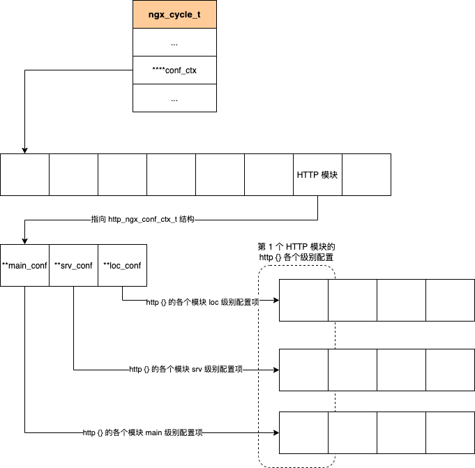
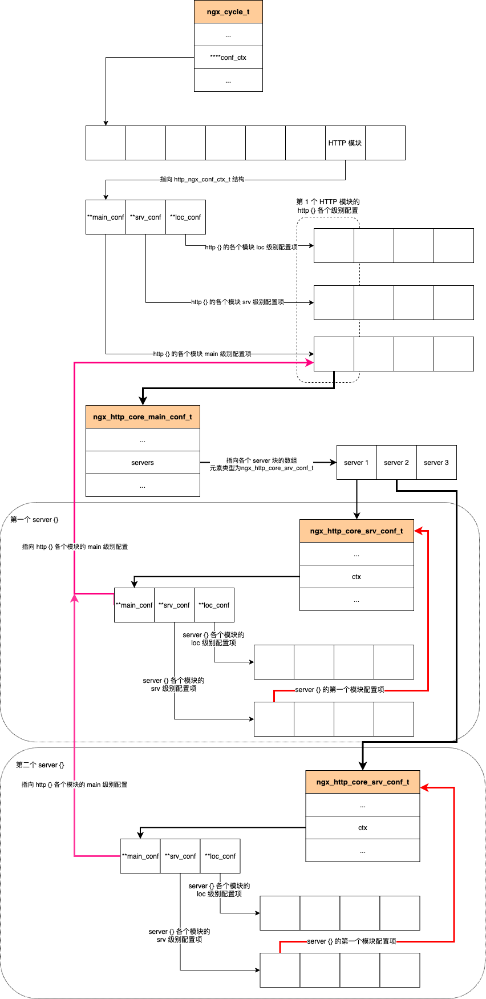
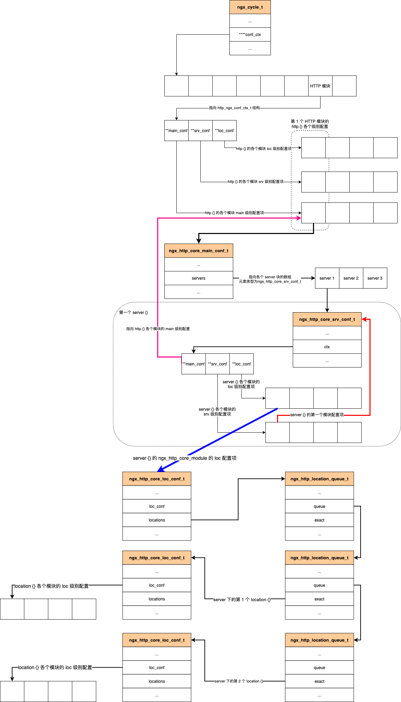

# HTTP 框架初始化

<!-- TOC -->

- [HTTP 框架初始化](#http-框架初始化)
    - [HTTP 模块的配置项](#http-模块的配置项)
    - [ngx_http_module_t 接口](#ngx_http_module_t-接口)
        - [main 级别配置项](#main-级别配置项)
        - [server 级别配置项](#server-级别配置项)
        - [location 级别配置项](#location-级别配置项)
        - [配置项合并](#配置项合并)
    - [监听端口的管理](#监听端口的管理)
    - [快速检索](#快速检索)
        - [server 的快速检索](#server-的快速检索)
        - [location 的快速检索](#location-的快速检索)
    - [十一个处理阶段](#十一个处理阶段)
        - [HTTP 处理阶段](#http-处理阶段)
        - [NGX_HTTP_POST_READ_PHASE 阶段](#ngx_http_post_read_phase-阶段)
        - [NGX_HTTP_SERVER_REWRITE_PHASE 阶段](#ngx_http_server_rewrite_phase-阶段)
        - [NGX_HTTP_FIND_CONFIG_PHASE 阶段](#ngx_http_find_config_phase-阶段)
        - [NGX_HTTP_REWRITE_PHASE 阶段](#ngx_http_rewrite_phase-阶段)
        - [NGX_HTTP_POST_REWRITE_PHASE 阶段](#ngx_http_post_rewrite_phase-阶段)
        - [NGX_HTTP_PREACCESS_PHASE 阶段](#ngx_http_preaccess_phase-阶段)
        - [NGX_HTTP_ACCESS_PHASE 阶段](#ngx_http_access_phase-阶段)
        - [NGX_HTTP_POST_ACCESS_PHASE 阶段](#ngx_http_post_access_phase-阶段)
        - [NGX_HTTP_TRY_FILES_PHASE 阶段](#ngx_http_try_files_phase-阶段)
        - [NGX_HTTP_CONTENT_PHASE 阶段](#ngx_http_content_phase-阶段)
        - [NGX_HTTP_LOG_PHASE 阶段](#ngx_http_log_phase-阶段)
    - [初始化流程](#初始化流程)

<!-- /TOC -->


## HTTP 模块的配置项

HTTP 模块的指令分为三个级别：

- main 级别，代表配置指令用于http，即针对 http {} 的配置。例如 variables_hash_max_size 配置。
- srv 级别，代表配置指令用于server，即针对 server {} 的配置。例如 listen、server_name 等配置。
- loc 级别，代表配置指令用于请求，即针对 location {} 的配置。

`create_main_conf` 创建 main 级别的配置文件，main 级别的配置指令都出现在 `http {}` 中，但并不是出现在 `http {}` 中的指令都是 main 级别的，`http {}` 中也可以使用针对 Server 和 请求的配置，这可以避免给每个 Server和请求都去进行配置。

`create_srv_conf` 创建 srv 级别的配置文件，srv 级别的配置指令都出现在 `server {}` 中，但并不是出现在 `server {}` 中的指令都是 srv 级别的，`server {}` 中也可以使用针对请求的配置，这可以避免给每个请求都去进行配置。

## ngx_http_module_t 接口

在 `ngx_module_t` 结构中，当 type 为 HTTP 模块时，其 ctx 成员指向了 `ngx_http_module_t` 结构，具体为：

```c
typedef struct {
    ngx_int_t   (*preconfiguration)(ngx_conf_t *cf);
    ngx_int_t   (*postconfiguation)(ngx_conf_t *cf);

    void        *(*create_main_conf)(ngx_conf_t *cf);
    char        *(*init_main_conf)(ngx_conf_t *cf, void *conf);

    void        *(*create_srv_conf)(ngx_conf_t *cf);
    void        *(*merge_srv_conf)(ngx_conf_t *cf, void *prev, void *conf);

    void        *(*create_loc_conf)(ngx_conf_t *cf);
    char        *(*merge_loc_conf)(ngx_conf_t *cf, void *prev, void *conf);
} ngx_http_module_t;
```

描述了如何创建模块指令在各个级别的配置文件。

解析到 http {} 时，会调用

- `create_main_conf`，创建 main 级别的配置结构。
- `create_srv_conf`，创建 srv 级别的配置结构。最终对于每个 server {} 的具体配置内容，由 http 和 server 的 srv_conf 合并后确定。
- `create_loc_conf`，创建 loc 级别的配置结构。最终对于每个 location {} 的具体配置内容，由 http、server、loc 的 loc_conf 合并后确定。

解析到 server {} 时，会调用

- `create_srv_conf`，创建 srv 级别的配置结构。最终对于每个 server {} 的具体配置内容，由 http 和 server 的 srv_conf 合并后确定。
- `create_loc_conf`，创建 loc 级别的配置结构。最终对于每个 location {} 的具体配置内容，由 http、server、loc 的 loc_conf 合并后确定。

解析到 location {} 时，回调用

- `create_loc_conf`，创建 loc 级别的配置结构。最终对于每个 location {} 的具体配置内容，由 http、server、loc 的 loc_conf 合并后确定。

### main 级别配置项

解析到 `http {}` 时，会调用模块的 create_main_conf、create_srv_conf 和 create_loc_conf 创建三个级别的配置结构。

很明显，对于每个 HTTP 模块的 `http {}` 都有三个级别的配置结构，为了保存这些配置结构，使用 `ngx_http_conf_ctx_t 结构体`：

```c
typedef struct {
    void **main_conf;
    void **srv_conf;
    void **loc_conf;
} ngx_http_conf_ctx_t;
```

在解析 `http {}` 时，会先生成 `ngx_http_conf_ctx_t` 对象，并存放于 `cycle->conf_ctx[6]`中。



对于第一个 http 模块，其三个级别的配置结构非常重要（因为存放了其他模块在 server {} 和 location {} 的配置项），分别为：

- `ngx_http_core_main_conf_t`
- `ngx_http_core_srv_conf_t`
- `ngx_http_core_loc_conf_t`

### server 级别配置项

在解析 `server {}` 时，会回调 ngx_http_core_server 方法（该方法属于 ngx_http_core_module 模块），在这个方法中，会解析 server {} 下的配置。

解析 server {} 和 http {} 时一样的，也会先创建 `ngx_http_conf_ctx` 结构：

- `ngx_http_conf_ctx.main_conf` 指向 http {} 中的 main_conf。
- `ngx_http_conf_ctx.srv_conf` 新分配数组内存，并循环调用各个模块的 create_srv_conf。
- `ngx_http_conf_ctx.loc_conf` 新分配数组内存，并循环调用各个模块的 create_loc_conf。

解析 `server {}` 是由 `ngx_http_core_module` 负责的，每个 server {} 都会有一个 `ngx_http_conf_ctx` 结构来存储各个模块的配置，每个 server 的 `ngx_http_conf_ctx` 可以通过 `ngx_http_core_module` 的 main 级别配置项（ngx_http_core_main_conf_t）寻找到。

ngx_http_core_main_conf_t 的结构中有一个 servers 指针，指向了所有 servers 的 ngx_http_core_srv_t 结构。

ngx_http_core_srv_conf_t 的结构中有一个 ctx 指针，该指针指向了对应 server 块生成的 ngx_http_conf_ctx_t 结构。

```c
typedef struct {
    ...
    ngx_array_t servers;        // 元素是 ngx_http_core_srv_conf_t
    ...
} ngx_http_core_main_t;

typedef struct {
    ...
    ngx_http_conf_ctx_t     *ctx;           // 指向所有模块在当前 server {} 对应的配置
    ngx_str_t               server_name;    // 当前 server 的名称
    ...
} ngx_http_core_srv_conf_t;
```

- `ngx_http_core_main_conf_t.servers[0].ctx` 第一个 server {} 的 ngx_http_conf_ctx
  - `ngx_http_core_main_conf_t.servers[0].ctx.srv_conf[0]` 第一个模块的第一个 server {} 的 srv 级配置项。
  - `ngx_http_core_main_conf_t.servers[0].ctx.srv_conf[1]` 第二个模块的第一个 server {} 的 srv 级配置项。
  - `ngx_http_core_main_conf_t.servers[0].ctx.loc_conf[1]` 第二个模块的第一个 server {} 的 loc 级配置项。
- `ngx_http_core_main_conf_t.servers[1].ctx` 第二个 server {} 的 ngx_http_conf_ctx
- `ngx_http_core_main_conf_t.servers[2].ctx` 第三个 server {} 的 ngx_http_conf_ctx



### location 级别配置项

在解析 server {} 的配置时，如果发现了 location {} 配置块，就会回调 `ngx_http_core_location` 方法，该方法属于 ngx_http_core_module 模块。

在解析到 `location {}` 时，同样会创建 `ngx_http_conf_ctx_t` 结构，但是 main_conf 和 srv_conf 都指向相应 server {} 的 main_conf 和 srv_conf。

对于 location {}，也会调用所有模块的 create_loc_conf ，并保存在 ngx_http_conf_ctx_t.loc_conf 数组中。

那 location {} 的 ngx_http_conf_ctx_t 结构是保存在哪里的呢？其实是保存在 ngx_http_core_loc_conf_s 结构体中：

```c
typedef struct ngx_http_core_loc_conf_s ngx_http_core_loc_conf_t;

struct ngx_http_core_loc_conf_s {
    ngx_str_t   name;               // location 的名称，其实就是 location 后面的表达式
    void        **loc_conf;         // 对应 location 块的 ngx_http_conf_ctx_t，保存了 location 块的所有 http 模块 loc 配置项
    ngx_queue_t *locations;         // 该 locations 指向 ngx_http_location_queue_t 中的 queue
};

typedef struct {
    ngx_queue_t                 queue;              // 将 Location 连接起来
    ngx_http_core_loc_conf_t    *exact;
    ngx_http_core_loc_conf_t    *inclusive;
    ngx_str_t                   *name;              // Location 的名称
} ngx_http_location_queue_t;
```

可以看出，server 下的 location 块是通过 ngx_http_location_queue_t.queue 进行串联的。而队列首元素，是在 server {} 的 ngx_http_core_moduel 的 loc 级别配置 `ngx_http_core_loc_conf_t` 中的。

locations 中可以进行 locations 的嵌套，只需要在对应的 ngx_http_core_loc_conf_t 的 locations 中添加队列即可。内存分布图如下：



**注意：**

- http {} 的各个级别的配置就存放在 `cycle->conf_ctx[http_module_index]` 的 main_conf、srv_conf、loc_conf 的数组中。
- server {} 的各个级别配置就存放在 `cycle->conf_ctx[http_module_index].main_conf[0].servers[i].ctx` 的 srv_conf、loc_conf 的数组中。
- loc {} 的 loc 级别配置就存放在 `cycle->conf_ctx[http_module_index].main_conf[0].servers[i].ctx.loc_conf.locations` 的队列中，当然要通过队列的 `ngx_http_location_queue_t.exact.loc_conf` 来获取。

### 配置项合并

HTTP 模块需要合并相同级别但是不同语句块的配置。

一个 Location 块真实使用的配置，需要将 Location 的所在 http 的 loc 配置和 Location 所在的 server 的 loc 配置进行合并，而后再和 Location 配置进行合并。

一个 Server 块真实使用的配置，需要将 Server 所在的 http 的 loc 配置和 Server 配置项进行合并。

## 监听端口的管理

对于 HTTP 模块，监听端口由 server {} 的 listen 配置决定，每监听一个 TCP 端口，都会用一个 ngx_http_conf_port_t 结构体表示：

```c
typedef struct {
    ngx_int_t   family;     // socket 地址家族
    in_port_t   port;       // 监听的端口
    ngx_array_t address;    // 监听端口的所有 IP 地址（机器的每个网卡都可以有 IP，这样一个端口可能对应了多个监听的 IP 地址），元素是  ngx_http_conf_addr_t。
} ngx_http_conf_port_t;

typedef struct {
    ngx_http_listen_opt_t       opt;        // 套接字的各种属性

    // 下面三个结构用于确定 server_name 后，通过 hash 表找到对应的 server {} 的 ngx_http_core_module 的 srv 级别配置项。
    // hash 表元素是 ngx_http_core_srv_conf_t。
    ngx_hash_t                  hash;
    ngx_hash_wildcard_t         *wc_head;
    ngx_hash_wildcard_t         *wc_tail;

#if (NGX_PCRE)
    ngx_uint_t                  nregx;
    ngx_http_server_name_t      *regerx;
#endif

    ngx_http_core_srv_conf_t    *default_server;        // 监听端口的默认 server 的 ngx_http_core_srv_conf_t
    ngx_array_t                 servers;                // 监听端口的所有 ngx_http_core_srv_conf_t
} ngx_http_conf_addr_t;

// 监听端口的信息 ngx_http_conf_port_t 由 ngx_http_core_module 的 main 级别配置项 `ngx_http_core_main_conf_t` 结构保存：

typedef struct {
    ...
    ngx_array_t     *ports;     // http {} 中的所有监听端口，元素是 ngx_http_conf_port_t
    ...
} ngx_http_core_main_conf_t;
```

`ports[i].address[j].servers` 第 i 个监听的端口的第 j 个地址，通过 servers ，将这个监听涉及到的 http_core_srv_conf_t 串联起来。

对于每一个 ngx_http_conf_addr_t 都有一个 ngx_listening_t 与其对应。

## 快速检索

### server 的快速检索

当一个 http 建立一个新连接时，为了避免通过 http_core_main_conf_t.servers 的遍历方式来找寻对应 server 的 ngx_http_core_srv_conf_t，通过 hash 表实现了优化。

建立连接后，其实是可很方便拿到 ngx_http_conf_addr_t 的（因为 ngx_listening_t 和 ngx_http_conf_addr_t 是一一对应的），再通过 `ngx_http_conf_addr_t.hash/wc_head/wc_tail` 来寻找对应的 http_core_srv_conf_t。

### location 的快速检索

## 十一个处理阶段

HTTP 处理有十一个阶段，在 Nginx 中通过枚举来标识：

```c
typedef enum {
    NGX_HTTP_POST_READ_PHASE = 0,           // 在接收到完整的 HTTP 头部后进行处理的阶段
    NGX_HTTP_SERVER_REWRITE_PHASE,          // 修改请求 URI 的一个阶段（在与 location 匹配前）
    NGX_HTTP_FIND_CONFIG_PHASE,             // 【不能被其他模块介入】根据请求 URI 匹配 locatio
    NGX_HTTP_REWRITE_PHASE,                 // 修改请求 URI 的一个阶段（在与 location 匹配后）
    NGX_HTTP_POST_REWRITE_PHASE,            // 【不能被其他模块介入】该阶段用于防止反复修改 URI 导致 REWRITE 死循环，目前超过 10 次 REWRITE 就认为死循环了
    NGX_HTTP_PREACCESS_PHASE,               // 该阶段用于对访问进行限制性处理（可能检查参数等等）
    NGX_HTTP_ACCESS_PHASE,                  // 该阶段用于判断请求是否拥有访问权限。
    NGX_HTTP_POST_ACCESS_PHASE,             // 【不能被其他模块介入】该阶段用于给 NGX_HTTP_ACCESS_PHASE 收尾
    NGX_HTTP_TRY_FILES_PHASE,               // 【不能被其他模块介入】
    NGX_HTTP_CONTENT_PHASE,                 // 用于处理 HTTP 请求内容的阶段
    NGX_HTTP_LOG_PHASE                      // 该阶段是请求处理完进行日志记录的
} ngx_http_phase;
```

### HTTP 处理阶段

HTTP 阶段回调处理包括一个 checker 方法和 handler 方法：

```c
typedef struct ngx_http_phase_handler_s ngx_http_phase_handler_t;

// checker 方法类型
typedef ngx_int_t ngx_http_phase_handler_pt(ngx_http_request_t *t, ngx_http_phase_handler_t *ph);

// handler 方法类型
typedef ngx_int_t (*ngx_http_handler_pt)(ngx_http_request_t *r);

// 一个阶段中的处理方法
struct ngx_http_phase_handler_s {
    ngx_http_phase_handler_pt   checker;    // 一个 HTTP 阶段进行处理时，若 checker 方法实现了，会直接调用 checker 方法，在 checker 方法中调用 handler 方法。
    ngx_http_handler_pt         handler;
    ngx_uint_t                  next;       // 将要执行的下一个 HTTP 处理阶段的序号（下一个阶段的首个 phase_handler 的序号）。
};
```

当 http {} 解析完毕后，会产生 ngx_http_phase_handler_t 的数组，并存储于  ngx_http_phase_engine_t 中，驱动阶段函数回调的 engine 存储在 http_core_module 的 main 级别配置项 ngx_http_core_main_conf_t 中。

```c
typedef struct {
    ngx_http_phase_handler_t    *handlers;                  // 表示一个请求会经历的所有 phase_handlers，并且已经根据处理顺序把顺序排好
    ngx_uint_t                  server_rewrite_index;       // NGX_HTTP_SERVER_REWRITE_PHASE 阶段的第一个 handler 的序号，用于快速跳转到该阶段
    ngx_uint_t                  location_rewrite_index;     // NGX_HTTP_REWRITE_PHASE 阶段的第一个 handler 的序号，用于快速跳转到该阶段
} ngx_http_phase_engine_t;

typedef struct {
    ngx_http_phase_engine_t     phase_engine;

    // 在解析模块的配置文件时，就是通过给该数组指定的位置添加自己的处理方法来介入阶段的。
    // 一个阶段的有很多模块的处理函数，因此 ngx_http_phase_t 中有一个 handlers 数组。
    // 这是一个临时变量，用来辅助构造 phase_engine
    ngx_http_phase_t            phases[NGX_HTTP_LOG_PHASE+1];
} ngx_http_core_main_conf_t;

typedef struct {
    // 每个元素都是一个 ngx_http_handler_pt
    ngx_array_t     handlers;
};
```

### NGX_HTTP_POST_READ_PHASE 阶段

TCP 连接接收到由客户端发送的完整 HTTP 头后触发，执行该阶段所有 phase_handler 的 checker 方法。该阶段的 checker 方法使用 `ngx_http_core_generic_phase`。

```c
ngx_int_t ngx_http_core_generic_phase(ngx_http_request_t *r, ngx_http_phase_handler_t *ph) {
    // 直接调用这一阶段的 handler
    ngx_int_t   rc = ph->handler(r);

    // 返回 NGX_OK 则进入下一个阶段的第一个 handler
    if (rc == NGX_OK) {
        r->phase_handler = ph->next;
        return NGX_AGAIN;
    }

    // 如果返回 NGX_DECLINED 则意味着要在当前阶段的下一个 handler 来进行处理
    if (rc == NGX_DECLINED) {
        r->phase_handler++;
        return NGX_AGAIN;
    }

    // 如果返回 NGX_AGAIN 或 NGX_DONE 意味着该阶段没有执行完毕，需要等待并继续处理
    if (rc == NGX_AGAIN || rc == NGX_DONE) {
        return NGX_OK;
    }

    ngx_http_finalize_request(r, rc);
    return NGX_OK;
}
```

`r->phase_handler` 代表着下一个要调用的 phase_handler 的序号。

### NGX_HTTP_SERVER_REWRITE_PHASE 阶段

这个阶段的 checker 是 `ngx_http_core_rewrite_phase`，其逻辑是根据不同的 handler 的返回来调整 `r->phase_handler`：

返回值 | 逻辑
-|-
NGX_DONE | 当前 handler 处理未结束，需要再次被调用
NGX_DECLINED | 当前 handler 执行完毕，顺序执行下一个 handler
其他 | 调用 ngx_http_finalize_request 结束请求

### NGX_HTTP_FIND_CONFIG_PHASE 阶段

该阶段是根据 URI 匹配 Location 的，也是实现 location 的基石。给该模块挂载自定义 handler，是会被忽略掉的。

### NGX_HTTP_REWRITE_PHASE 阶段

该阶段是匹配到 location 后，还可以再 rewrite 的阶段，其处理后 `NGX_HTTP_SERVER_REWRITE_PHASE 阶段` 完全一致。

### NGX_HTTP_POST_REWRITE_PHASE 阶段

该解答u你的 checker 方法是 `ngx_http_core_post_rewrite_phase`，该方法的意义在于检查 rewrite 的 URL 次数不超过十次。

### NGX_HTTP_PREACCESS_PHASE 阶段

该阶段的 checker 是 `ngx_http_core_generic_phase`。

### NGX_HTTP_ACCESS_PHASE 阶段

该阶段的 checker 逻辑和 satisfy 配置相关，这一阶段的 handler 需要根据当前的 satisfy 的配置来返回值，而 satisfy 的值存储于 ngx_http_core_module 的 loc 级别配置中：

```c
struct ngx_http_core_loc_conf_s {
    ngx_uint_t satisfy;
};
```

简而言之：

- `satisfy all` 意味着所有 http 模块的 access 阶段都通过，才能通过。
- `satisfy any` 意味着所有 http 模块的 access 阶段只要通过其中之一，就能通过。

返回值 | 逻辑
-|-
NGX_OK | 若 `satisfy all` 则执行下一个 handler，若 `satisfy any` 则执行下一个阶段的 handler。
NGX_DECLINED | 顺序执行下一个 hander。
NGX_AGAIN | 当前方法没有处理完毕。
NGX_DONE | 当前方法没有处理完毕。
NGX_AGAIN | 当前方法没有处理完毕。
NGX_HTTP_FORBIDDEN | 若 `satisfy all` 则调用 `ngx_http_finalize_request` 结束请求。若 `satisfy any` 则设置 `ngx_http_request_t` 中的 access_code 为 返回值，并调用下一个阶段的 handler。
NGX_ERROR | 调用 `ngx_http_finalize_request` 结束请求。
其他 | 调用 `ngx_http_finalize_request` 结束请求。

### NGX_HTTP_POST_ACCESS_PHASE 阶段

其实就是检查 ngx_http_request_t 的 access_code 成员，当不为 0 时，结束请求。

这是因为 `satify any` 时，若 http 模块都返回无权限，那么就会通过设置 access_code 来告诉下一个阶段，若所有模块都判断没有权限，在 NGX_HTTP_POST_ACCESS_PHASE 通过 access_code 进行权限的统一判定。

### NGX_HTTP_TRY_FILES_PHASE 阶段

该阶段的 checker 方法是 `ngx_http_core_try_files_phase`。

该阶段于 try_files 配置项相关，如果 try_files 后指定资源中，有一个可以访问，就会直接读取该文件并发送响应给用户，并不会执行后续的阶段了。

如果所有的资源都无法执行，则执行紧挨着的下一个阶段。

### NGX_HTTP_CONTENT_PHASE 阶段

### NGX_HTTP_LOG_PHASE 阶段

最后一个阶段，进行收尾工作，记录日志。该阶段的 checker 是 `ngx_http_core_generic_phase`。

## 初始化流程


