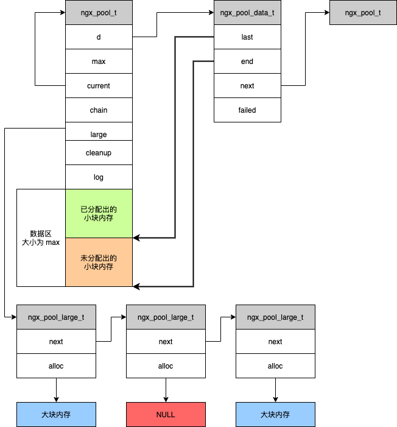

# Nginx 基础架构

对应书中的 `第 8 章 Nginx 基础架构`，仅列出本章中个人感觉重要且有意义的点。

<!-- TOC -->

- [Nginx 基础架构](#nginx-基础架构)
    - [Nginx 架构设计](#nginx-架构设计)
        - [模块化设计](#模块化设计)
        - [请求的多阶段异步处理](#请求的多阶段异步处理)
    - [Nginx 的核心结构体](#nginx-的核心结构体)
        - [ngx_listen_t](#ngx_listen_t)
        - [ngx_cycle_t](#ngx_cycle_t)
    - [Nginx 启动处理流程](#nginx-启动处理流程)
    - [Nginx Worker 工作流程](#nginx-worker-工作流程)
    - [Nginx Master 工作流程](#nginx-master-工作流程)
    - [ngx_pool_t](#ngx_pool_t)
    - [疑问](#疑问)

<!-- /TOC -->

## Nginx 架构设计

### 模块化设计

### 请求的多阶段异步处理

## Nginx 的核心结构体

### ngx_listen_t

Nginx 首先需要监听端口并处理网络事件。

```c
typedef struct ngx_listening_s ngx_listening_t;

struct ngx_listening_s {
    ngx_socket_t        fd;                 // sokcet 套接字具柄
    struct socketaddr   *sockaddr;          // 监听 sockaddr 地址
    socklen_t           socklen;            // sockaddr 地址唱的
    size_t              addr_text_max_len;  // 存储 addr_text 的最大长度
    ngx_str_t           addr_text;          // 以字符串形式存储 IP 地址
    int                 type;               // 套接字类型 例如 type 是 SOCK_STREAM 表示 TCP
    int                 backlog;            // TCP 监听的 backlog 队列，在三次握手完成后，还未被 accept 的最多连接个数
    int                 rcvbuf;             // 内核中对于这个套接字的接收缓冲区大小
    int                 sndbuf;             // 内核中对于这个套接字的发送缓冲区大小

    // =============== TCP 连接创建成功后的回调处理 =============
    // 函数原型为 typedef void (*ngx_connection_handler_pt)(ngx_connection_t *c);
    // 许多事件消费模块（例如 HTTP 模块）都会定义 Listen 的 handler
    ngx_connection_handler_pt   handler;
    // ======================================================

    void                    *servers;
    ngx_log_t               log;
    ngx_log_t               *logp;
    ngx_msec_t              post_acceept_time_out;
    ngx_listening_t         *previous;

    // =========== 监听句柄对应 connection ==============
    // 在 epoll event module 初始化的时候，会将 connection->read->handler 配置为 ngx_event_accept
    // 这样在收到 TCP 三次握手请求的时候，就可以触发对应的事件回调，并获取对应的连接，并且会进一步回调 ngx_listening_t.handler
    ngx_connection_t        *connection;
    // ================================================

    unsigned                open:1;
    unsigned                remain:1;
    unsigned                ignore:1;
    unsigned                bound:1;
    unsigned                inherited:1;
    unsigned                nonblocking_Accept:1;
    unsigned                listen:1;
    unsigned                nonblocking:1;
    unsigned                shared:1;
    unsigned                addr_ntop:1;
}
```

### ngx_cycle_t

无论是 master 进程还是 worker 进程，每个进程都拥有一个 `ngx_cycle_t`。

在 Nginx 进程启动后，`ngx_init_cycle()` 用于进行 `ngx_cycle_t` 的构造。

```c
typedef struct ngx_cycle_s ngx_cycle_t;

struct ngx_cycle_s {
    void                ****conf_ctx;
    ngx_pool_t          *pool;
    ngx_log_t           *log;
    ngx_log_t           new_log;
    ngx_uint_t          files_n;
    ngx_connection_t    **files;
    ngx_connection_t    *free_connections;
    ngx_uint_t          free_connection_n;
    ngx_queue_t         reusable_connections_queue;
    ngx_array_t         listening;
    ngx_array_t         pathes;
    ngx_list_t          open_files;
    ngx_list_t          shared_memory;
    ngx_connection_t    *connectinos;
    ngx_event_t         *read_events;
    ngx_event_t         *write_events;
    ngx_cycle_t         *old_cycle;
    ngx_str_t           conf_file;
    ngx_str_t           conf_param;
    ngx_str_t           conf_prefix;
    ngx_str_t           prefix;
    ngx_str_t           lock_file;
    ngx_str_t           hostname;
};
```

每个模块都可以通过特定的回调获得对 ngx_cycle_t 的掌控权：

```c
struct ngx_module_s {
    ...

    ngx_int_t           (*init_module)(ngx_cycle_t *cycle);
    ngx_int_t           (*init_process)(ngx_cycle_t *cycle);
    ngx_int_t           (*init_thread)(ngx_cycle_t *cycle);
    void                (*exit_thread)(ngx_cycle_t *cycle);
    void                (*exit_process)(ngx_cycle_t *cycle);
    void                (*exit_master)(ngx_cycle_t *cycle);

    ...
};
```

ngx_cycle_t 相关的方法：

- `ngx_cycle_t ngx_init_cycle(ngx_cycle_t *old_cycle)`
- `ngx_int_t ngx_process_options(ngx_cycle_t *cycle)`
  - Nginx 启动时，命令行通常会携带目录参数，该函数解析命令行参数，得到配置文件路径，设置到 `ngx_cycle_t` 中。
- `ngx_init_t ngx_add_inherited_sockets(ngx_cycle_t *cycle)`
  - 在平滑升级过程中，旧 master 进程通过 NGINX 环境变量传递监听端口信息。
  - 新的 master 进程通过该函数从环境变量中读取信息，来使用已经打开的监听端口。
- `ngx_init_t ngx_open_listening_sockts(ngx_cycle_t *cycle)`
  - 统一打开 cycle 中的 listening 数组中的端口，即开始监听。
- `ngx_init_t ngx_configure_listening_sockets(ngx_cycle_t *cycle)`
- `ngx_init_t ngx_close_listening_sockets(ngx_cycle_t *cycle)`
  - 关闭 cycle 中的 listening 数组中打开的端口。
- `ngx_init_t ngx_master_process_cycle(ngx_cycle_t *cycle)`
  - 进入 master 进程的工作循环。
- `ngx_init_t ngx_single_process_cycle(ngx_cycle_t *cycle)`
- `ngx_init_t ngx_start_worker_processes(ngx_cycle_t *cycle, ngx_int_t n, ngx_int_t type)`
- `void ngx_start_cache_manager_processes(ngx_cycle_t *cycle, ngx_uint_t respawn)`
- `void ngx_pass_open_channel(ngx_cycle_t *cycle, ngx_channel_t *ch)`
- `void ngx_signal_worker_processes(ngx_cycle_t *cycle, int signo)`
- `void ngx_reap_children(ngx_cycle_t *cycle)`
- `void ngx_master_process_exit(ngx_cycle_t *cycle)`
- `void ngx_worker_process_cycle(ngx_cycle_t *cycle)`
- `void ngx_worker_process_init(ngx_cycle_t *cycle)`
- `void ngx_worker_process_exit(ngx_cycle_t *cycle)`
- `void ngx_cache_manager_process_cycle(ngx_cycle_t *cycle, void *data)`
- `void ngx_process_events_and_timers(ngx_cycle_t *cycle)`

## Nginx 启动处理流程

1. Nginx 启动时，首先解析命令行参数。Nginx 会预先创建一个临时的 `ngx_cycle_t` 变量，用以存储配置文件路径和一个输出到屏幕的 log。对于配置文件路径的生成依赖于 `ngx_process_options(ngx_cycle_t)` 函数。
1. 随后判断是否处于平滑升级，若是，则通过 `ngx_add_inherited_sockets(ngx_cycle_t)` 从环境变量中继承原 master 进程的相关信息，以使用原 master 进程的监听端口，以实现平滑升级。
1. 此时调用 ngx_init_cycle 方法，会去读取、解析 `nginx.conf` 配置文件。
1. 调用所有`核心模块`的 `create_conf` 方法。而对于非核心模块的配置解析，则是交给了核心模块来完成，因为任何一个非核心模块，都是从属于某一个核心模块的。非核心模块的配置解析是由核心模块去约定的。需要注意，一般并不是核心模块的 `create_conf` 触发了去创建子模块的配置，子模块的配置创建往往是在解析对应的语句块指令时，其回调触发的。例如事件模块的子模块都是在 `event {}` 这个配置项的解析回调中对子模块的配置进行创建和解析。
1. 遍历 `nginx.conf` 的所有配置项，对于任何配置项，会检查所有`核心模块`的配置项，以找出对它感兴趣的模块。
1. 调用所有核心的的 `init_conf` 方法，通知解析完毕。
1. 创建目录、打开文件、初始化共享内存。
1. 此时所有模块都已经拿到了自己的监听端口，并添加到 `ngx_cycle_t` 的 listening 数组中了，Nginx 框架这一步将会把这些监听端口全部打开。即调用 `ngx_open_listening_sockts(ngx_cycle_t)`。
1. 调用所有模块的 `init_module` 方法。
1. 根据 Nginx 的工作模式，会有不同的执行方式：
    1. 单进程模式
        1. 调用所有模块的 `init_process` 方法。
        1. 调用 `ngx_single_process_cycle(ngx_cycle_t)`。
    1. master-worker
        1. 调用所有模块的 `init_process` 方法。
        1. 调用 `ngx_worker_process_cycle(ngx_cycle_t)`。

## Nginx Worker 工作流程

master 通过信号来控制 worker 进程，因此每个 worker 都会注册信号处理方法，即 `ngx_signal_handler`，该信号处理函数主要谁根据接收到的信号来设置全局标识：

信号 | 全局标识 | 意义
-|-|-
QUIT | ngx_quit | 优雅关闭
TERM/INT | ngx_terminate | 强制关闭
USR1 | ngx_reopen | 重新打开所有文件

除此外，还有全局标识 `ngx_exiting` 用来表示准备关闭 worker 进程，不受信号控制，而是 worker 内部控制的变量。

Worker 进程都处于 `ngx_worker_process_cycle(ngx_cycle_t)` 循环中循环运行。

## Nginx Master 工作流程

Nginx 的 Master 进程不会处理网络事件和业务，只会通过信号对 worker 子进程进行管理，以实现重启服务、平滑升级、更换日志文件、重载配置文件等功能。

Master 进程运行与函数 `ngx_master_process_cycle` 中，并会用 7 个标识位来控制具体的行为：

```c
sig_atomic_t  ngx_reap;           // 标识子进程意外结束。Master 进程接收信号 CHILD 触发。
sig_atomic_t  ngx_terminate;      // 标识 Nginx 需要强制关闭。Master 进程接收信号 TERM/INT 触发。
sig_atomic_t  ngx_quit;           // 标识 Nginx 需要优雅关闭。Master 进程接收信号 QUIT 触发。
sig_atomic_t  ngx_reconfigure;    // 标识 Nginx 需要重新加载配置。Master 进程接收信号 HUP 触发。
sig_atomic_t  ngx_reopen;         // 标识 Nginx 需要重新打开文件。Master 进程接收信号 USR1 触发。
sig_atomic_t  ngx_change_binary;  // 标示 Nginx 需要重新打开二进制文件。Master 进程接收信号 USR2 触发。
sig_atomic_t  ngx_noaccept;       // 标识 Nginx 子进程不再处理新的连接。相当于给所有的子进程发送 QUIT 信号。Master 进程接收信号 WINCH 触发。
```

热启动一个新的 Nginx 步骤如下：

1. `kill -s USR2 ${nginx-master-pid}` 给 Nginx Master 进程的 PID 发送信号 USR2，用新的二进制文件新启动一个 Nginx Master-Worker。
1. `kill -s WINCH ${nginx-master-pid}` 给 Nginx Master 进程的 PID 发送信号 WINCH（这里是给原 Nginx Master PID 发送信号），结束掉老的 Nginx Worker 进程。
1. `kill -s QUIT ${nginx-master-pid}` 给 Nginx Master 进程的 PID 发送信号 QUIT（这里是给原 Nginx Master PID 发送信号），结束掉老的 Nginx Master 进程。

之所以要把结束旧进程的 Worker 和 Master 分开，是为了便于观察新 Nginx 进程的工作是否满足预期，如果不满足预期，可以进行回滚。

在关闭 Nginx Master 前，如果发现新二进制文件存在问题，可以进行回滚，步骤如下：

1. `kill -s HUP ${ngx-master-pid}` 给 Nginx Master 进程的 PID 发送信号 HUP（老的 Nginx Master PID），重新加载配置文件，会触发恢复 Worker 进程。
1. `kill -s QUIT ${new-nginx-master-pid}` 给 Nginx Master 进程的 PID 发送信号 QUIT（新的 Nginx Master PID），让新的 Nginx 退出。

Master 管理子进程时用到了数据结构 `ngx_process_t`，具体如下:

```c
// 定义 1024 个元素的 ngx_process 数组。也就是最多只能有 1024 个子进程。
#define NGX_MAX_PROCESSES 1024

// 当前操作的进程在 ngx_processes 数组的下标
ngx_int_t ngx_process_slot;

// 存储所有子进程数组
ngx_process_t ngx_processes[NGX_MAX_PROCESSES];

typedef struct {
    ngx_pid_t           pid;                // 进程 PID。
    int                 status;             // 通过 waitpid 获得进程状态。

    ngx_socket_t        channel[2];         // 通过 socketpair 生成的一组 socket，用于父子进程间通信。目前作用于 Master 和 Worker 的通信。

    ngx_spawn_proc_pt   proc;               // 子进程循环执行的方法，父进程调用 ngx_spawn_process 生成进程时使用。
    void                *data;              // ngx_spawn_proc_pt proc 进行调用时传入的上下文参数。

    char                *name;              // 进程名称。

    unsigned            respawn:1;          // 为 1 时，表示在重新生成子进程。
    unsigned            just_spawn:1;       // 为 1 时，表示正在生成子进程。
    unsigned            detached:1;         // 为 1 时，表示正在进行父子进程分离。
    unsigned            exiting:1;          // 为 1 时，表示进程正在退出。
    unsigned            exited:1;           // 为 1 时，表示进程已经退出。
} ngx_process_t;
```

Master 进程通过 `ngx_spawn_process` 启动子进程，该函数中会进行 fork 的调用，并使用 ngx_prcoesses 中的一个未使用的对象存放该子进程的相关信息，如果 1024 个全部用尽，则会返回 NGX_INVALID_PID。

```c
ngx_pid_t ngx_spawn_process(ngx_cycle_t* cycle, ngx_spawn_proc_pt proc, void *data, char *name, ngx_int_t respawn);
```

参数 | 描述
-|-
cycle | ngx_cycle_t。
proc | 启动子进程后，子进程会调用的函数。
data | proc 中的 data 参数。
name | 子进程名称。
respawn | 不清楚。

其中 `ngx_spawn_proc_pt` 指针结构如下：

```c
typedef void (*ngx_spawn_proc_pt)(ngx_cycle_t *cycle, void *data);
```

对于 Nginx 的 Worker 有一个统一的函数：

```c
static void ngx_worker_process_cycle(ngx_cycle_t *cycle, void *data);
```

对于缓存管理的子进程而言的：

```c
static void ngx_cache_manager_process_cycle(ngx_cycle_t *cycle, void *data);
```

下面简述 Nginx Master 进程处理步骤：

1. Nginx Master 进程接收到信号，唤醒 Master 进程进行处理。
1. ngx_reap 若为 1，则以为着有 Worker 进程意外死亡，Master 进程通过 `ngx_reap_children` 管理子进程，该函数中遍历子进程
   - 对于非正常（ngx_terminate 和 ngx_quit 都为 0 时退出的子进程，认为时非正常退出）退出的子进程会进行拉起。
   - 若所有子进程都退出了，返回 live 为 0，反之为 1。
1. live 为 0 时，且 ngx_terminate 为 1 活 ngx_quit 为 1，表示所有子进程都正常退出了，开始调用 `ngx_master_process_exit` 退出 master 进程。
   1. 删除进程号的 PID 文件。
   1. 调用所有模块的 `ngx_master_process_exit` 方法。
   1. 调用 `ngx_close_listening_sockets` 关闭进程中打开的监听端口。
   1. 销毁内存池，退出 master 进程。
1. 若 live 为 1，且 ngx_terminate 为 1，则认为要强制关闭 Nginx，Master 进程会给所有子进程发送 TERM 信号。回到第一步，等待 CHILD 信号激活。
1. 若 live 为 1，且 ngx_quit 为 1，则认为要优雅关闭 Nginx，Master 进程关闭监听的端口，并会给所有子进程发送 QUIT 信号。回到第一步，等待 CHILD 信号激活。
1. 若 ngx_reconfigure 为 1，表示要重新读取配置文件。Nginx 重新初始化 ngx_cycle_t 结构体，读取新的配置文件，拉起新的 Worker 进程，并销毁旧的 Worker 进程（QUIT 信号）。
1. 若 ngx_restart 为 1，则重新拉起 worker 进程。
1. 若 ngx_reopen 为 1，通过调用 `ngx_reopen_files` 方法，重新打开所有文件。
1. 若 ngx_change_binary，用最新的二进制文件启动新的 Nginx 进程。
1. 若 ngx_noaccept 为 1，则给所有子进程发出 QUIT 信号，并将 ngx_noaccepting 置为 1，表示 Nginx 停止接收新连接。

**注意：**

Nginx Master 并非一直循环处理，而是通过信号驱动，即接收到信号时才会被唤醒并处理：

```sh
sigsuspend(&set);
```

## ngx_pool_t

Nginx 内存池由 `ngx_pool_t` 表示：

```c
typedef struct ngx_pool_s ngx_pool_t;

struct ngx_pool_s {
    // 小块内存的空间，当空间不足以分配的小块内存，会再生成一个 ngx_pool_s，并通过 ngx_pool_date_t->next 进行连接
    ngx_pool_data_t     d;

    // 评估大块小块的标准
    size_t              max;

    // 大块内存直接从堆中分配，并通过链表进行连接
    // 需要注意 ngx_pfree 释放大块内存时，会遍历链表，因此要尽量避免频繁使用短周期的大块内存
    ngx_pool_large_t    *large;

    ngx_pool_cleanup_t  *cleanup;
    ngx_log_t           *log;
};

struct ngx_pool_large_s {
    // 链表连接
    ngx_pool_large_t    *next;

    // 指向大块内存
    void                *alloc;
};

typedef struct {

    // 未分配内存的首地址
    u_char      *last;

    // 当前小块的尾地址
    u_char      *end;

    // 下一个内存次
    ngx_pool_t  *next;

    // 每当剩余空间不足以分配出小内存块时，failed 递增，当超过 4，则 ngx_pool_t 的 current 将移动到下一个内存池。
    ngx_uint_t  failed;
} ngx_pool_data_t;
```

很巧妙，如果小块内存申请在当前的内存池多次失败，就意味着当前内存剩余的空间太小，所以把 current 移动到下一个内存池。

和内存池有关的方法有：

- 内存池
  - ngx_create_pool
  - ngx_destroy_pool
  - ngx_reset_pool
- 分配和释放内存
  - ngx_palloc
  - ngx_pnalloc
  - ngx_pcalloc
  - ngx_pemalign
  - ngx_pfree
- 随着内存池释放同步释放资源
  - ngx_pool_cleanup_add
  - ngx_pool_run_cleanup_file
  - ngx_pool_cleanup_file
  - ngx_pool_delete_file

使用内存池后，模块开发者只需要关注内存分配。

内存池对大内存和小内存的分配管理方式是不同的：

- 小内存直接从内存池的预分配空间中获取。
- 大内存直接从 Heap 空间中分配，并记录在 ngx_pool_t 中。

对于大内存和小内存的区分，是在 `ngx_create_pool` 的 size 参数决定的，size 参数小于 `NGX_MAX_ALLOC_FROM_POOL - sizeof(ngx_pool_t)` 时，分界线就是 `size - sizeof(ngx_pool_t)`，否则分界线就是 `NGX_MAX_ALLOC_FROM_POOL`。

```c
#define NGX_MAX_ALLOC_FROM_POOL (ngx_pagesize - 1)
```

在 X86 上，ngx_pagesize 就是 4096，即 NGX_MAX_ALLOC_FROM_POOL 是 4095。

**注意：**

- 小块内存如果释放，意味着内存浪费，因为那部分不可能再被使用。
- 大块内存如果释放，可能会导致性能降低（遍历链表导致）。

`ngx_pool_cleanup_add` 会返回一个清理处理器结构，用于指出用户自定义回收时的处理：

```c
struct ngx_pool_cleanup_s {
    ngx_pool_cleanup_pt     handler;
    void                    *data;      // 回调 handler 时，会带给 handler，用以提供回调上下文。
    ngx_pool_clanup_t       *next;
};
```



## 疑问

- 非核心模块的配置文件解析和设置由谁负责
- init_module 和 init_process 谁全部模块还是仅核心模块
- pool 工作原理，如果释放内存是否会导致内存碎片积累
